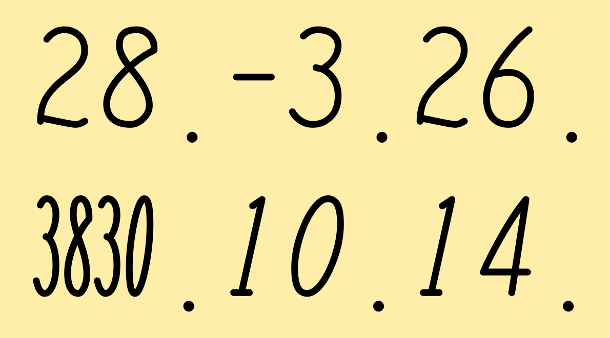

# TU ダッチング体

TU ダッチング体 は、ダッチングマシン（硬券用日付印字機）で印字される文字を再現したフォントです。



## フォントの種類

以下の 2 種類があります。

- **TU Dating Regular**（和名: TU ダッチング体 Regular）
  - 4 桁西暦以外の数字や日付など、通常の用途向け
- **TU Dating Compressed Regular**（和名: TU ダッチング体 Compressed Regular）
  - 4 桁西暦用
  - Regular よりも横幅が狭い圧縮書体

どちらも数字、ピリオド、ハイフン、スペースに対応しています。

## 独自スペース文字

Compressed Regular には、数字のまとまりの前後に余白を付けるための独自スペース文字があります。

- Unicode: `U+E000`
- グリフ名: `digitgroupspace`
- 字幅: 50 フォントユニット
- アウトライン: なし

### コピー用

次のインラインコードの中身が U+E000 です。見た目は空白ですが、選択してコピーできます。

``

4 桁西暦の前後に配置した状態も、次の文字列からコピーできます。

`2020`

例えば、4 桁西暦の前後に U+E000 を配置すると、Compressed Regular で 75 ユニットの余白を追加できます。

```text README.md
U+E000 2020 U+E000
```

HTML では、次のように記述できます。

```html README.md
&#xE000;2020&#xE000;
```

U+E000 は私用領域の文字なので、Compressed Regular 以外のフォントでは正しく表示されない場合があります。

## ビルド方法

フォントの生成には[FontForge](https://fontforge.org/)が必要です。

macOS では Homebrew からインストールできます。

```sh README.md
brew install fontforge
```

リポジトリのルートディレクトリで、次のコマンドを実行してください。

```sh README.md
fontforge -script src/build_fonts.py
```

ビルドスクリプトは、以下の SVG を読み込みます。

- `svg/regular/`
- `svg/compressed_regular/`

生成されたフォントは`fonts/`に出力されます。

- `fonts/TUDating-Regular.ttf`
- `fonts/TUDating-CompressedRegular.ttf`

SVG の各ファイルの`width`が、そのまま対応する字形の字幅として使用されます。SVG 内の左右余白は保持され、SVG のキャンバス外に追加の文字間隔は設定されません。

## ライセンス

SIL Open Font License 1.1（OFL-1.1）
